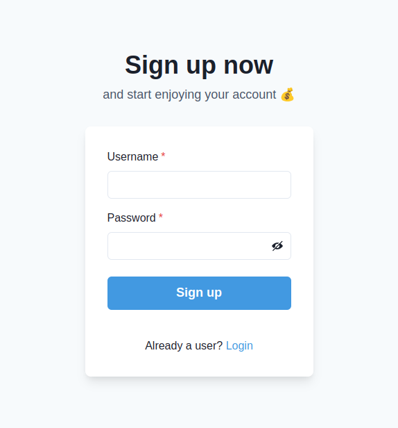
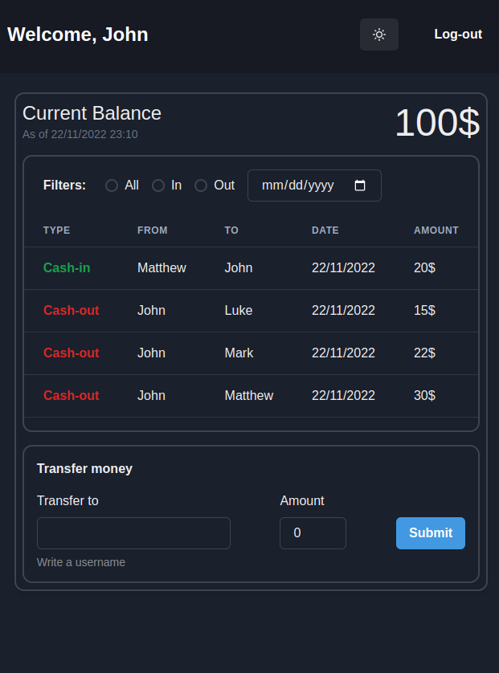

# NG Cash

## Pre-requisitos para rodar este projeto:

- Git
- NPM
- Docker
- Docker Compose

# Como usar este projeto

1. Clone este repositório:

```
git clone git@github.com:andersonfpcorrea/ng-cash.git
```

2. Acesse o diretório raiz do projeto:

```
cd ng-cash
```

3. Suba os containers:

```
docker-compose up -d
```

4. Acesse _[localhost:5173](http://localhost:5173/)_ para entrar na página de cadastro do app.

   </br>

   

   </br>

5. Para interromper a execução do app:

```
docker-compose down
```

## Acessando o app

A partir daqui você se cadastrar para acessar o app, ou ir para a página de [login](http://localhost:5173/login) e usar umas das contas pre-salvas no banco de dados:

| User    | Password  |
| ------- | :-------: |
| John    | 123456Abc |
| Luke    | 123456Abc |
| Mark    | 123456Abc |
| Matthew | 123456Abc |

## Autenticação

- **username** deve ter pelo menos 3 caracteres.
- **password** deve ter pelo menos 8 caracteres e incluir pelo menos uma letra maiúscula e um número.

O método de autenticação utilizado no app é "Bearer token". Um JWT com 24h de validade é enviado ao cliente ao se cadastrar e ao fazer login.

## Transferências entre contas cadastradas

</br>



Para fazer transferências basta digitar o **username** do destinatário e o valor a ser transferido. O valor não pode ser maior que o **saldo** e também não é possível transferir dinheiro para si mesmo 😃 e nem para usuários inexistentes.

As transferências válidas são processadas no servidor, salvas no banco de dados **Postgres**, e então os dados do **dashboard** são atualizados.

## Filtros

Você pode filtrar as transações realizadas por tipo (**cash-in** e **cash-out**) e também por data.

# Set-up do projeto

## Backend:

- TypeScript
- Node.js
- Express
- Sequelize
- ESLint

## DB

- Postgres

## Frontend

- TypeScript
- React
- React router
- Chackra UI
- Tailwind CSS
- ESLint
