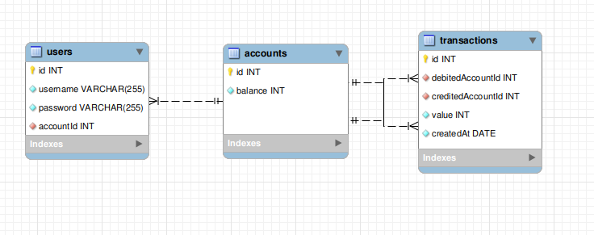

# NG Cash

Uma aplicaçao web **fullstack dockerizada** cujo objetivo é possibilitar transferências bancárias entre usuários do banco **_NG Cash_**

## Pre-requisitos para rodar este projeto:

- Git
- NPM
- Docker
- Docker Compose

# Como usar este projeto

1. Clone este repositório:

```
git clone git@github.com:andersonfpcorrea/ng-cash.git
```

2. Acesse o diretório raiz do projeto:

```
cd ng-cash
```

3. Suba os containers:

```
docker-compose up -d
```

4. Acesse _[localhost:5173](http://localhost:5173/)_ para entrar na página de cadastro do app.

   </br>

   

   </br>

5. Para interromper a execução do app:

```
docker-compose down
```

## Acessando o app

A partir daqui você pode se cadastrar para acessar o app, ou ir para a página de [login](http://localhost:5173/login) e usar umas das contas pre-salvas no banco de dados:

| User    | Password  |
| ------- | :-------: |
| John    | 123456Abc |
| Luke    | 123456Abc |
| Mark    | 123456Abc |
| Matthew | 123456Abc |

## Autenticação

- **username** deve ter pelo menos 3 caracteres.
- **password** deve ter pelo menos 8 caracteres e incluir pelo menos uma letra maiúscula e um número.

O método de autenticação utilizado no app é "Bearer token". Um JWT com 24h de validade é enviado ao cliente ao se cadastrar e ao fazer login.

## Transferências entre contas cadastradas

</br>


Para fazer transferências basta digitar o **username** do destinatário e o valor a ser transferido. O valor não pode ser maior que o **saldo** e também não é possível transferir dinheiro para si mesmo 😃 e nem para usuários inexistentes.

As transferências válidas são processadas no servidor, salvas no banco de dados **Postgres**, e então os dados do **dashboard** são atualizados.

## Filtros

Você pode filtrar as transações realizadas por tipo (**cash-in** e **cash-out**) e também por data.

# Todas as features

<details open>
<summary><strong>💰 Leia aqui a lista completa de features do app 💰</strong></summary>
<br />

## Resumo

Aplicação web full stack **dockerizada** cujo objetivo é possibilitar a realização de transferências bancárias entre usuários do banco.

## Backend

I. Stack

- Servidor em Node.js com TypeScript;
- Sequelize ORM
- Banco de dados PostgreSQL

</br>



</br>

II. Arquitetura do banco de dados

- Tabela **users**
  - **id** - _Primary key_
  - **username** - Identificação do usuário
  - **password** - codificada (_hashed_) no banco de dados
  - **accountId** - _Foreign key_ - **accounts.id**
- Tabela **accounts**
  - **id** - _Primary key_
  - **balance** - saldo do cliente
- Tabela **transactions**
  - **id** - _Primary key_
  - **debitedAccountId** - _Foreign key_ - **acounts.id**
  - **creditedAccountId** - _Foreign key_ - **acounts.id**
  - **value**
  - **createdAt**

III - Regras de negócio

- Qualquer pessoa pode se cadastrar, bastando informar _username_ e _password_;
- Cada _username_ é único e composto de pelo menos 3 caracteres;
- _passwords_ são compostas de 8 ou mais caracteres, sendo pelo menos um número e uma letra maiúscula;
- Durante o processo de cadastro de um novo usuário, sua conta bancária é criada automaticamente na tabela **accounts**, com saldo inicial de R$100. Caso ocorra algum problema durante a criação do usuário, a tabela **accounts** não é afetada;
- Todos os usuários podem logar na aplicação informando _username_ e _password_. Quando o login é bem sucedido, um token JWT (com 24h de validate) é enviado ao cliente;
- O usuário logado (_com um token válido_) é capaz de visualizar seu próprio saldo. Um usuário não consegue ver o saldo de outro.
- O usuário logado é capaz de realizar transferências (_cash-out_) informando o _username_ do destinatário, caso tenha saldo suficiente. Não é possível realizar transferências para si mesmo;
- Toda nova transação bem sucedida é registrada na tabela **transactions**. Em caso de falha na transação, a tabela **transactions** não é afetada.
- O usuário logado consegue visualizar as transações financeiras (_cash-in_ e _cash-out_) de que participou. Não é possível ver transações das quais não participou;
- O usuaário logado é capaz de filtrar transações por data de realização e/ou por tipo (_cash-in/cash-out_).

## Frontend

I. Stack

- React com TypeScript
- CSS3/TailwindCSS
- React Router

II. Regras da interface visual

- Página de cadastro em que se informam _username_ e _password_;
- Página de login em que se informam _username_ e _password_;
- Com o usuário logado, a página principal apresenta:
  - Saldo atual
  - Seção para transferências entre usuários do banco. A transferência é feita informando _username_ do destinatário e valor da transação;
  - Tabela com detalhes de todas as transações;
  - Mecanismo para filtrar a tabela de transações por tipo e/ou data;
  - Botão para realizar _log-out_.

</details>

# Set-up do projeto

## Backend:

- TypeScript v.4.9.3
- Node.js v.18.12.0
- Express v.4.18.2
- Sequelize v.6.25.6
- ESLint v.8.27.0

## DB

- Postgres

## Frontend

- Vite v.3.2.3
- TypeScript v.4.9.3
- React v.18.2.0
- React router v.6.4.3
- Chackra UI v.2.4.1
- Tailwind CSS v.3.2.4
- ESLint v.8.27
